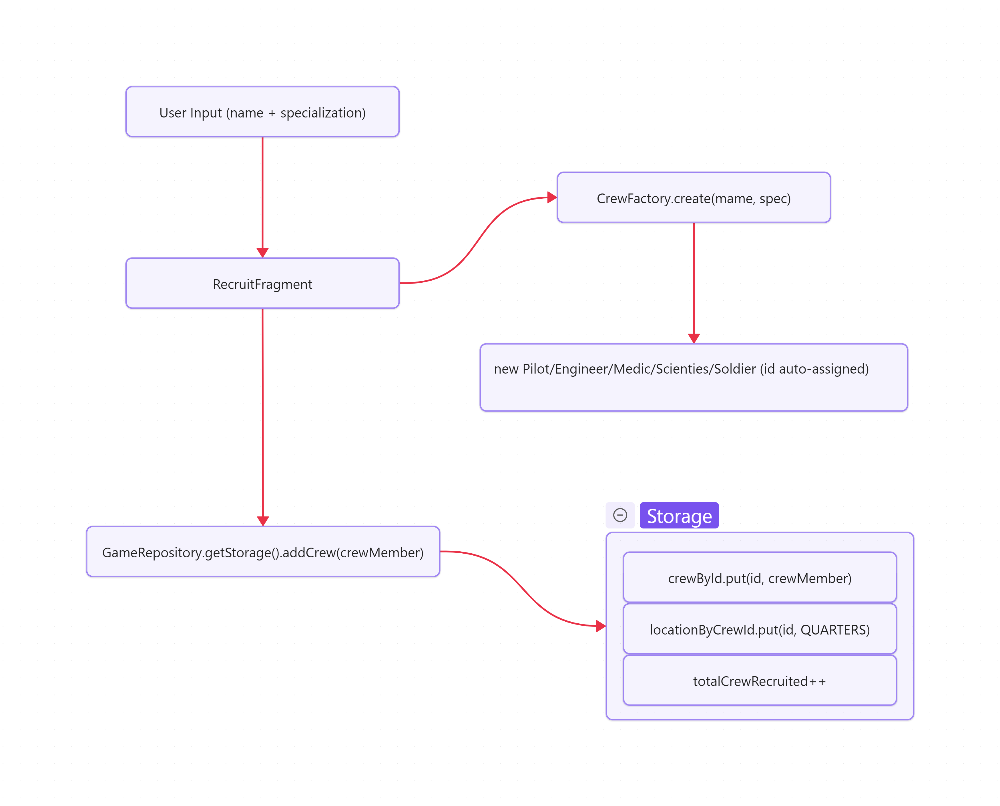
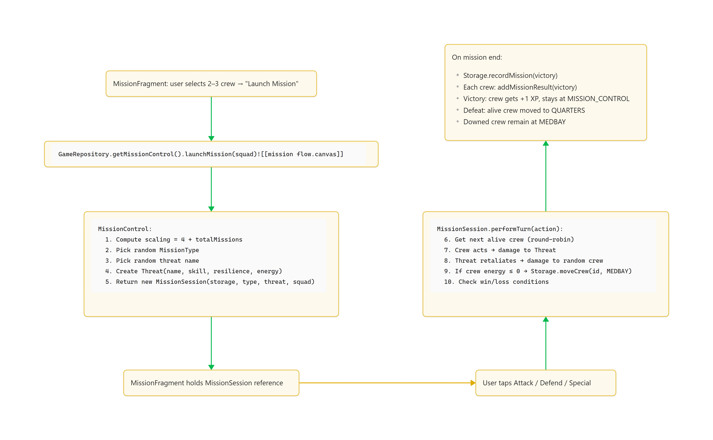

# **Space Colony**

Project Documentation

**Authors:**

| **Name**                   | **Student Id** | **Email**                                                           |
| -------------------------- | -------------- | ------------------------------------------------------------------- |
| Md Mahi Al Jubair Talukder | 001166325      | [Mahi.Talukder@student.lut.fi](mailto:Mahi.Talukder@student.lut.fi) |
| Tasnuba Nourin Oyshe       | 001168828      | [Tasnuba.Oyshe@student.lut.fi](mailto:Tasnuba.Oyshe@student.lut.fi) |

## **Table of Contents**:

- [1. Project description](#1-project-description)
- [2. Class Diagram](#2-class-diagram)
- [3. Implemented Features](#3-implemented-features)
  - [3.1 Mandatory Features](#31-mandatory-features)
  - [3.2 Bonus Features](#32-bonus-features)
- [4. Team Composition](#4-team-composition)
- [5. Application Use Flow](#5-application-use-flow)
- [6. Installation Instructions](#6-installation-instructions)
- [7. Links](#7-links)
- [8. Tools Used](#8-tools-used)
- [9. AI Usage Disclaimer](#9-ai-usage-disclaimer)
- [10. How It Was Implemented](#10-how-it-was-implemented)
  - [10.1 Tech Stack](#101-tech-stack)
  - [10.2 System Architecture](#102-system-architecture)
    - [10.2.1 Model Layer](#1021-model-layer)
    - [10.2.2 Repository Layer](#1022-repository-layer)
    - [10.2.3 UI Layer](#1023-ui-layer)
  - [10.3 Core Logic and Algorithms](#103-core-logic-and-algorithms)
    - [10.3.1 Crew Creation and the Factory Pattern](#1031-crew-creation-and-the-factory-pattern)
    - [10.3.2 Combat System (Turn-Based Algorithm)](#1032-combat-system-turn-based-algorithm)
    - [10.3.3 Experience and Training System](#1033-experience-and-training-system)
    - [10.3.4 Difficulty Scaling](#1034-difficulty-scaling)
    - [10.3.5 Statistics Calculation](#1035-statistics-calculation)
  - [10.4 Data Flow](#104-data-flow)
    - [10.4.1 Recruitment Flow](#1041-recruitment-flow)
    - [10.4.2 Mission Flow](#1042-mission-flow)
    - [10.4.3 Save / Load Flow](#1043-save--load-flow)
    - [10.4.4 Crew Location State Machine](#1044-crew-location-state-machine)

# 1. Project Description

Space Colony is an Android-based space colony crew management game developed in Java using Android Studio. The player manages a space station crew by recruiting members from five unique specializations (Pilot, Engineer, Medic, Scientist, and Soldier), training them in a simulator to gain experience, and sending them on cooperative turn-based missions against system-generated threats.

**Core Gameplay**

- **Recruit** crew members with distinct stats and specialization bonuses.
- **Train** them in the Simulator to increase their experience and skill power.
- **Deploy** squads of 2–3 crew members to Mission Control and launch cooperative missions.
- **Survive** turn-based combat against scaling threats (Asteroid Storms, Alien Boarding Parties, Solar Flare Cascades, Critical Reactor Leaks).
- **Recover** defeated crew in the Medbay and manage your colony's long-term performance.

The application features a polished dark space-themed UI with animated starfields, Material Design 3 components, smooth fragment transitions, and custom vector icons for each crew specialization.

# 2. Class Diagram

The class diagram below shows the model and logic layer of the application, **excluding UI classes** (Activities, Fragments, Adapters, Views) as per the project requirements.

# 3. Implemented Features

## 3.1 Mandatory Features

|                           |                                                                                                                                                                                                |
| ------------------------- | ---------------------------------------------------------------------------------------------------------------------------------------------------------------------------------------------- |
| **Feature**               | **Status**                                                                                                                                                                                     |
| **Object-Oriented Code**  | Abstract CrewMember base class with 5 subclasses (Pilot, Engineer, Medic, Scientist, Soldier). Polymorphic getMissionBonus(). Encapsulation via private fields. Factory pattern (CrewFactory). |
| **Code in English**       | All code, comments, variable names, and UI strings, documentation and the video dialogues are in English.                                                                                      |
| **Android Compatibility** | Built in Java using Android Studio with Material Design 3 components. minSdk 24, targetSdk 36.                                                                                                 |
| **Basic Functionality**   | Full crew management: recruit → quarters → simulator/mission control. Turn-based cooperative missions. Experience system. Energy restoration.                                                  |
| **Documentation**         | This document.                                                                                                                                                                                 |

## 3.2 Bonus Features

|       |                              |            |                                                                                                                                                                                                                                                                                   |
| ----- | ---------------------------- | ---------- | --------------------------------------------------------------------------------------------------------------------------------------------------------------------------------------------------------------------------------------------------------------------------------- |
| **#** | **Feature**                  | **Points** | **Implementation Details**                                                                                                                                                                                                                                                        |
| 1     | **RecyclerView**             | +1         | CrewAdapter extends RecyclerView.Adapter. Used in Quarters, Simulator, Mission Control, Medbay, and Statistics screens.                                                                                                                                                           |
| 2     | **Crew Images**              | +1         | Custom vector drawable icons per specialization (ic_pilot.xml, ic_engineer.xml, ic_medic.xml, ic_scientist.xml, ic_soldier.xml). Displayed on crew cards and in mission logs.                                                                                                     |
| 3     | **Mission Visualization**    | +2         | Animated threat energy bar with ObjectAnimator. Structured mission log entries with per-actor icons (crew specialization icons, threat warning icon). Color-coded log entries (cyan for system, red for threats). Animated crew energy bars during combat. Threat card with icon. |
| 4     | **Tactical Combat**          | +2         | Three player-chosen actions per turn: Attack, Defend, Special. Defend grants a resilience boost on the next incoming hit. Special ability deals extra damage. Threat acts automatically.                                                                                          |
| 5     | **Statistics**               | +1         | Per-crew tracking: missions completed, victories, lost missions, training sessions, XP. Colony-wide: total recruited, total missions, win count, training sessions.                                                                                                               |
| 6     | **No Death**                 | +1         | Defeated crew members are sent to Medbay (Location.MEDBAY) instead of being removed. Recovery applies an XP penalty (experience - 1) and restores energy. Lost missions tracked in lostMissions.                                                                                  |
| 7     | **Randomness in Missions**   | +1         | CrewMember.act() adds random.nextInt(3). Threat.attack() adds random.nextInt(3). Threat stats vary: skill and resilience include random ranges in MissionControl.launchMission().                                                                                                 |
| 8     | **Specialization Bonuses**   | +2         | Each subclass overrides getMissionBonus(MissionType): Pilot → NAVIGATION (+2), Engineer → REPAIR_STATION (+2), Medic → RESCUE (+2), Scientist → RESEARCH (+2), Soldier → COMBAT (+2).                                                                                             |
| 9     | **Larger Squads**            | +2         | Mission supports 2–3 crew members. CrewAdapter max selection set to 3 in MissionFragment. MissionSession handles variable squad sizes with round-robin turn order.                                                                                                                |
| 10    | **Fragments**                | +2         | 7 Fragments: HomeFragment, RecruitFragment, QuartersFragment, SimulatorFragment, MissionFragment, MedbayFragment, StatsFragment. Abstract LocationFragment base class for shared behavior. Custom fragment transition animations.                                                 |
| 11    | **Data Storage & Loading**   | +2         | DataManager uses Java ObjectOutputStream/ObjectInputStream for serialization. Save/Load buttons in navigation bar. Storage and CrewMember implement Serializable. ID counter restored on load.                                                                                    |
| 12    | **Statistics Visualization** | +2         | Custom BarChartView draws animated horizontal bars showing per-crew victories, color-coded by specialization. Animated win-rate progress bar.                                                                                                                                     |

# 4. Team Composition

We are a team of two members; we divided the tasks among ourselves equally. Here is a breakdown of who did what. The documentation and video demo were done by both of us. We worked on a single GitHub repo from the same computer for better and faster collaboration. 

**Tasnuba Nourin Oyshe (001168828)**

- **UI Design & Implementation**: All XML layouts (activity*main.xml, all fragment*\*.xml, item_crew.xml, item_mission_log.xml), themes, styles, colors, and dimension resources.
- **Custom Views & Animations**: StarfieldView (animated background), UiEffects (stagger, pulse, fade-in animations), fragment transition animations, crew card entry animations.
- **Statistics UI**: StatsFragment, BarChartView custom chart, win-rate progress bar visualization.
- **Recruit Screen**: RecruitFragment with specialization preview, spinner integration, and crew image preview.
- **Navigation**: HorizontalScrollView navigation bar design, LocationFragment abstract base class.

**Md Mahi Al Jubair Talukder (001166325)**

- **Core Model Layer**: CrewMember (abstract), Pilot, Engineer, Medic, Scientist, Soldier subclasses, Threat, MissionType, Location, CrewAction enums.
- **Mission System**: MissionControl, MissionSession (turn-based combat loop), MissionLogEntry (structured logging), tactical combatactions (Attack/Defend/Special).
- **Storage & Data**: Storage class with HashMap<Integer, CrewMember>, DataManager for serialization/deserialization, GameRepository singleton.
- **Medbay System**: Medbay class, no-death recovery with XP penalty.
- **Custom Icons**: Vector drawable icons for each specialization (ic_pilot, ic_engineer, ic_medic, ic_scientist, ic_soldier, ic_threat).
- **Crew Adapter**: CrewAdapter with selection logic, animated energy bars, specialization-based visuals via CrewVisuals.

# 5. Application Use Flow

1. **Home Screen** — Overview of crew counts per sector (Quarters, Simulator, Mission Control, Medbay) and colony analytics.
2. **Recruit** — Enter a name, choose a specialization from the dropdown, see a preview with the role icon, then tap "Recruit to Quarters."
3. **Quarters** — View crew at rest (RecyclerView with checkboxes). Select members and move them to Simulator or Mission Control.
4. **Simulator** — Select crew members and tap "Train Selected" to award +1 XP each. Tap "Move to Quarters" to send them home with full energy.
5. **Mission Control** — Select 2–3 crew members, tap "Launch Mission." A threat is generated. Choose actions each turn (Attack / Defend / Special). The mission log shows each action with icons. Threat energy bar animates down. Crew energy bars update in real time.
6. **Medbay** — Defeated crew appear here. Tap "Recover and Move to Quarters" to restore them with an XP penalty.
7. **Stats** — View colony win rate (animated progress bar), per-crew victories bar chart, and detailed per-crew performance stats.
8. **Save / Load** — Persist game state to internal storage or load a previous save.

# 6. Installation Instructions

Navigate to the directory you want to install the app. Open terminal in that directory and run the following command.

1. Clone the repository:

      git clone https://github.com/LordMahi19/space-colony

   2. Open the project in **Android Studio**.  
3. Ensure Android SDK 36 is installed (or whichever compileSdk is specified).  
4. Connect an Android device or start an emulator (minSdk 24 / Android 7.0+).  
5. Click **Run** **▶** to build and deploy.

No additional dependencies beyond the standard Android/Material libraries are required.

Or you can just download the apk file from this drive link and install it directly on your android phone that is android 7 or higher:

[https://drive.google.com/file/d/1YIB8RTapSdiqCzQtL8uNB8A7x3Ix-i0S/view?usp=sharing](https://drive.google.com/file/d/1YIB8RTapSdiqCzQtL8uNB8A7x3Ix-i0S/view?usp=sharing)

# 7. Links

- **GitHub Repository**: [https://github.com/LordMahi19/space-colony](https://github.com/LordMahi19/space-colony)
- **Demo Video**: [https://drive.google.com/file/d/1Z46idBwWbtueaf5NlHaAa615nXrj3sW\_/view?usp=sharing](https://drive.google.com/file/d/1Z46idBwWbtueaf5NlHaAa615nXrj3sW_/view?usp=sharing)

# 8. Tools Used

- **Language**: Java 11
- **IDE**: Android Studio
- **UI Framework**: Material Design 3 (Material Components for Android)
- **Build System**: Gradle (Kotlin DSL)
- **Version Control**: Git / GitHub
- **Documentation and word processing**: Microsoft word
- **Data Persistence**: Java Serialization (ObjectOutputStream / ObjectInputStream)

# 9. AI Usage Disclaimer

Mermaid AI was used to make UML class diagrams. Gemini was used for research and ideation. VS codes autocomplete features were used when writing small functions. Claude was used for debugging.

# 10. How It Was Implemented

## 10.1 Tech Stack

|                      |                                                                                                                                                                                                                                        |
| -------------------- | -------------------------------------------------------------------------------------------------------------------------------------------------------------------------------------------------------------------------------------- |
| **Component**        | **Technology**                                                                                                                                                                                                                         |
| **Language**         | Java 11 — chosen for full Android compatibility and strong OOP support for the inheritance-based crew model.                                                                                                                           |
| **Platform**         | Android (minSdk 24 / Android 7.0, targetSdk 36) — provides broad device coverage while allowing use of modern APIs.                                                                                                                    |
| **IDE**              | Android Studio — the official Android development environment with integrated emulator, layout editor, and Gradle tooling.                                                                                                             |
| **Build System**     | Gradle with Kotlin DSL (build.gradle.kts) — manages dependencies, SDK versions, and build variants declaratively.                                                                                                                      |
| **UI Framework**     | Material Design 3 (Material Components for Android) — provides MaterialButton, MaterialCardView, TextInputEditText, themed spinners, and consistent design tokens.                                                                     |
| **UI Architecture**  | Single-Activity, multi-Fragment — MainActivity hosts a fragmentContainer and swaps 7 Fragments via FragmentManager, using custom enter/exit animations.                                                                                |
| **Data Display**     | RecyclerView with CrewAdapter — efficiently renders scrollable crew lists with card-based items, checkbox selection, animated energy bars, and specialization icons.                                                                   |
| **Data Persistence** | Java Serialization (ObjectOutputStream / ObjectInputStream) — the entire Storage object graph (crew map + location map + aggregate stats) is serialized to a single binary file (space_colony_save.bin) in the app's internal storage. |
| **Animations**       | Android ObjectAnimator, ViewPropertyAnimator, and custom UiEffects utility — used for threat energy bar transitions, crew energy bar updates, staggered child reveals, pulse effects, and fragment transitions.                        |
| **Custom Graphics**  | StarfieldView (custom View) for the animated starfield background; BarChartView (custom View) for the statistics bar chart; Vector drawable XML icons for each crew specialization and threats.                                        |
| **Version Control**  | Git / GitHub — single shared repository.                                                                                                                                                                                               |

**Dependencies** (from build.gradle.kts):

- androidx.appcompat — backward-compatible Activity and Fragment APIs
- com.google.android.material — Material Design 3 components
- androidx.activity — modern Activity result APIs
- androidx.constraintlayout — flexible layout engine for complex screens

No third-party networking, database (Room, SQLite), or dependency injection libraries are used. The project has zero external dependencies beyond the standard AndroidX and Material libraries.

## 10.2 System Architecture

The application follows a **three-layer architecture** with clear separation of concerns:

### 10.2.1 Model Layer

(com.example.spacecolony.model — 17 classes):

- Pure Java classes with no Android dependencies (except `DataManager` which uses Context for file I/O).
- `CrewMember` is an abstract base class with five concrete subclasses. Each subclass defines its own base stats (skill, resilience, max energy) and overrides `getMissionBonus(MissionType)` for polymorphic specialization bonuses.
- `Storage` acts as the in-memory data store, holding two `HashMap` collections: `crewById` (crew objects keyed by ID) and `locationByCrewId` (mapping crew IDs to their current Location enum value). It also tracks aggregate statistics.
- `MissionControl` generates missions with scaling difficulty. `MissionSession` encapsulates the turn-based combat state machine. `Threat` represents the enemy with its own stats and damage model.
- `CrewFactory` implements the Factory pattern to instantiate the correct `CrewMember` subclass from a specialization string.

### 10.2.2 Repository Layer

(GameRepository — singleton):

- Acts as the single point of access for all game state.
- Holds references to `Storage`, `MissionControl`, and `Medbay`.
- Provides high-level operations: `move(), train(), recoverFromMedbay(), save(), load().`
- On load, it reconstructs MissionControl and Medbay with the deserialized Storage instance and restores the `CrewMember`.nextId counter.

### 10.2.3 UI Layer

(com.example.spacecolony.ui — 14 classes):

- `MainActivity` is the single host Activity. It pre-creates all Fragment instances, binds navigation buttons, and handles Save/Load via `GameRepository`.
- `LocationFragment` is an abstract base Fragment that provides a template for Quarters, Simulator, and Medbay screens — each subclass only overrides `sourceLocation()`, `primaryText(), onPrimary()`, etc.
- `MissionFragment` is a standalone Fragment (not extending LocationFragment) because the mission screen has a unique layout with a threat card, action buttons, and a mission log — it directly manages its own `MissionSession`.
- `CrewAdapter` is a shared `RecyclerView.Adapter` used across all list screens. It supports configurable max selection, animated energy bars (`ObjectAnimator`), staggered row entry animations, and dynamic card stroke/elevation based on selection state.
- `CrewVisuals` centralizes the mapping from specialization strings to drawable resources and ARGB colors.
- UiEffects provides reusable animation utilities: `staggerChildren()` for cascading child reveals, `pulse()` for scale bounce, and `fadeIn()` for alpha transitions.

## 10.3 Core Logic and Algorithms

### 10.3.1 Crew Creation and the Factory Pattern

When the player recruits a crew member, `RecruitFragment` calls `CrewFactory`.create(name, specialization) which uses a switch statement to instantiate the correct subclass. Each subclass constructor passes fixed base stats to the `CrewMember` superclass:

|                    |                |                     |                     |                        |
| ------------------ | -------------- | ------------------- | ------------------- | ---------------------- |
| **Specialization** | **Base Skill** | **Base Resilience** | **Base Max Energy** | **Bonus Mission Type** |
| Pilot              | 5              | 4                   | 20                  | NAVIGATION (+2)        |
| Engineer           | 5              | 3                   | 18                  | REPAIR_STATION (+2)    |
| Medic              | 4              | 3                   | 22                  | RESCUE (+2)            |
| Scientist          | 4              | 2                   | 18                  | RESEARCH (+2)          |
| Soldier            | 8              | 1                   | 16                  | COMBAT (+2)            |

The crew member is assigned a unique auto-incrementing id (via static int nextId) and placed in Location.QUARTERS.

### 10.3.2 Combat System (Turn-Based Algorithm)

The combat system in MissionSession follows a **round-robin, player-driven turn loop**:

1. **Mission Launch**: MissionControl.launchMission() generates a random MissionType, picks a random threat name from four options, and creates a Threat with scaled stats:

- Threat skill = 4 + totalMissions + random(0–2)
- Threat resilience = 2 + random(0–2)
- Threat energy = 22 + 4 + totalMissions (scales with game progression)

3. **Player Turn** (performTurn(CrewAction)):

- The next alive crew member is selected via round-robin (actorIndex wraps around the squad).
- Based on the chosen action:

- **ATTACK**: outgoing = baseSkill + experience + missionBonus + random(0–2)
- **DEFEND**: Sets a defend flag on the crew member (no damage output). The next time this crew member takes damage, they get +2 resilience.
- **SPECIAL**: outgoing = baseSkill + experience + missionBonus + 1 + random(0–3) (higher damage ceiling).

- Damage dealt to the threat: max(0, outgoing − threat.resilience).

5. **Threat Retaliation** (automatic, every turn):

- The threat selects a random alive crew member as a target.
- Threat attack = threat.skill + random(0–2).
- Damage dealt to the crew member: max(0, incoming − (baseResilience + defenseBoost)).
- If a crew member's energy reaches 0, they are moved to Location.MEDBAY.

7. **Termination**:

- **Victory**: The threat's energy drops to 0. Surviving crew gain +1 XP and a mission win is recorded.
- **Defeat**: All squad members are downed. Surviving crew (none) are moved to Quarters; downed crew remain in Medbay.

### 10.3.3 Experience and Training System

- **Training**: Calling CrewMember.train() increments both experience and trainingSessions by 1. The experience value directly increases effective skill: effectiveSkill = baseSkill + experience + missionBonus.
- **Mission XP**: On victory, each surviving crew member gains +1 XP via grantMissionXp().
- **Medbay Recovery Penalty**: applyMedbayPenalty() reduces experience by 1 (min 0) and fully restores energy. This creates a risk/reward dynamic — losing missions costs XP.

### 10.3.4 Difficulty Scaling

Threat stats scale with the total number of missions completed (stored in Storage.totalMissions). The scaling variable 4 + totalMissions is added to both threat skill and energy, ensuring progressively harder encounters. Random variance (nextInt(3)) on both crew and threat actions introduces unpredictability.

### 10.3.5 Statistics Calculation

- **Win Rate**: (totalMissionWins \* 100) / max(1, totalMissions), displayed as an animated progress bar.
- **Per-Crew Stats**: Each CrewMember tracks missionsCompleted, victories, lostMissions, trainingSessions, and experience individually.
- **Bar Chart**: BarChartView renders horizontal bars sized proportionally to victories, color-coded by specialization via CrewVisuals.color().

## 10.4 Data Flow

### 10.4.1 Recruitment Flow

### 10.4.2 Mission Flow

### 10.4.3 Save / Load Flow

` call. Moving to QUARTERS automatically restores energy via `CrewMember.restoreEnergy().` Moving to MEDBAY after defeat preserves the crew member (no permanent death). Recovery from Medbay applies an XP penalty via `applyMedbayPenalty().`
